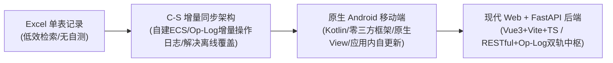
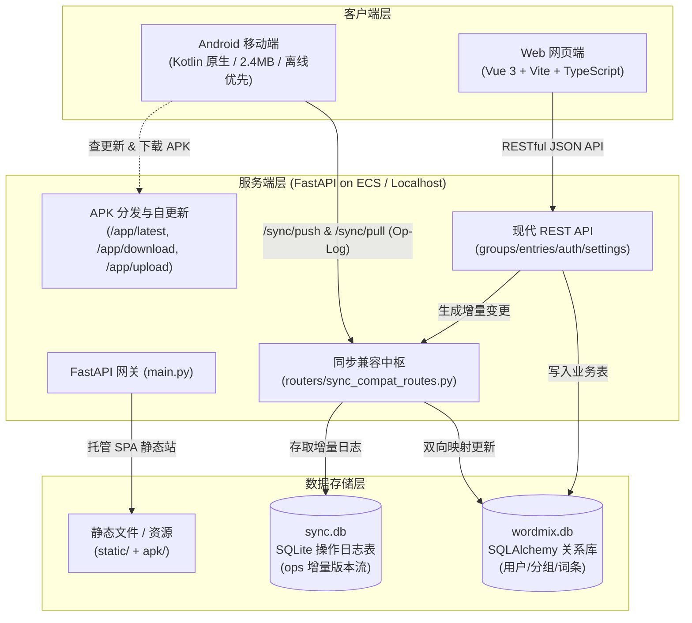

# 单词混记 (WordMix) · 业务与架构全景及二次开发指南

> **面向读者**：新加入项目的工程师、技术伙伴以及接手维护与开发的 AI Agent。  
> **文档目标**：梳理业务背景、架构设计、核心机制（遮挡自测/增量同步/自更新）、关键代码定位与防坑指南，使新人/新 Agent 能够在 10 分钟内全面吃透项目脉络，零试错上手二次开发。

---

## 目录

- [1. 业务背景与演进历程](#1-业务背景与演进历程)
  - [1.1 核心痛点与产品定位](#11-核心痛点与产品定位)
  - [1.2 架构演进路线图](#12-架构演进路线图)
  - [1.3 核心设计哲学](#13-核心设计哲学)
- [2. 全局系统架构与技术选型](#2-全局系统架构与技术选型)
  - [2.1 拓扑架构图](#21-拓扑架构图)
  - [2.2 核心技术栈与端划分](#22-核心技术栈与端划分)
  - [2.3 存储设计：关系数据库与操作日志双引擎](#23-存储设计关系数据库与操作日志双引擎)
- [3. 核心业务机制与算法实现](#3-核心业务机制与算法实现)
  - [3.1 数据模型设计（分组 + 词条）](#31-数据模型设计分组--词条)
  - [3.2 遮挡自测（Flashcard Recall）机制](#32-遮挡自测flashcard-recall机制)
  - [3.3 增量操作同步引擎（Op-Log 与最终一致性）](#33-增量操作同步引擎op-log-与最终一致性)
  - [3.4 双轨兼容中枢（REST 与 Op-Log 桥接）](#34-双轨兼容中枢rest-与-op-log-桥接)
  - [3.5 离线优先（Offline-First）与原子存储](#35-离线优先offline-first与原子存储)
  - [3.6 Android 应用内自更新链路](#36-android-应用内自更新链路)
  - [3.7 音标转换与智能相似词推荐](#37-音标转换与智能相似词推荐)
- [4. 关键代码定位（代码地图 Code Map）](#4-关键代码定位代码地图-code-map)
  - [4.1 安卓端 (android/app/)](#41-安卓端-androidapp)
  - [4.2 服务端 (server/)](#42-服务端-server)
  - [4.3 Web 前端 (web/)](#43-web-前端-web)
  - [4.4 构建与部署工具 (build/ & tools/)](#44-构建与部署工具-build--tools)
- [5. 开发环境与本地运行指南](#5-开发环境与本地运行指南)
  - [5.1 依赖环境准备](#51-依赖环境准备)
  - [5.2 启动本地全栈服务（推荐开发方式）](#52-启动本地全栈服务推荐开发方式)
  - [5.3 Web 前端独立调试](#53-web-前端独立调试)
  - [5.4 安卓端编译与运行（⚠ 必看 ASCII 路径）](#54-安卓端编译与运行-必看-ascii-路径)
- [6. 质量保障与自动化测试体系](#6-质量保障与自动化测试体系)
  - [6.1 服务端自动化测试](#61-服务端自动化测试)
  - [6.2 安卓端单元测试 (JVM 无依赖测试)](#62-安卓端单元测试-jvm-无依赖测试)
  - [6.3 严格测试数据隔离守则](#63-严格测试数据隔离守则)
- [7. 打包、构建与云端发布部署](#7-打包构建与云端发布部署)
  - [7.1 安卓 APK 签名构建与上传](#71-安卓-apk-签名构建与上传)
  - [7.2 服务端与 Web 一键热更新发布](#72-服务端与-web-一键热更新发布)
- [8. 血泪踩坑与开发者避坑守则](#8-血泪踩坑与开发者避坑守则)

---

## 1. 业务背景与演进历程

### 1.1 核心痛点与产品定位
英语学习中普遍存在一类痛点：**形近、同根或语义微妙易混淆的单词**（例如：`moral` / `morale` / `mortal`、`contact` / `contract` / `contrast`、`persecute` / `prosecute`）。
市面上绝大多数背单词软件（百词斩、墨墨等）采用单词流式呈现，易混淆词散落在不同章节；用户最初使用本地 Excel 表格记录（一行记录一组混淆词），但面临严重瓶颈：
1. **录入与检索慢**：每录入一个新词，都需要肉眼扫描整个表格，查找是否已有该分组。
2. **缺乏自测交互**：Excel 无法快速一键遮挡释义或单词来进行抗遗忘自测。
3. **多端割裂**：无法在手机（碎片时间复习）和电脑浏览器（高强度录入）之间平滑对齐。

**产品核心定位**：专为“易混淆单词”打造的高性能、分组式记忆与自测工具，采用 **Android 原生移动端 + Web 响应式网页端 + FastAPI 云端服务** 的全栈架构。

### 1.2 架构演进路线图



- **Phase 1 (Excel)**：用户原始积累，按行记录混淆词组。
- **Phase 2 (自建云同步与 C-S 架构)**：在阿里云 ECS 搭建集中式同步中枢。采用**增量操作日志（Op-Log）**，彻底消除文件全量覆盖问题。
- **Phase 3 (原生 Android 端)**：拒绝网页套壳，用原生 Kotlin 打造流畅轻巧（仅 2.4MB）的 Android 原生应用，集成断点续传应用内自更新。
- **Phase 4 (Web 现代化与新一代 API)**：引入 FastAPI + SQLAlchemy 后端和 Vue 3 现代响应式 Web 端，通过 `sync_compat_routes.py` 将现代 REST API 与传统增量 Op-log 无缝打通，电脑端直接通过浏览器 Web 访问，彻底淘汰旧桌面本地 exe。

### 1.3 核心设计哲学
1. **极致轻量与零三方依赖偏好**：
   - 安卓端：不引入 Jetpack Compose / Retrofit / OkHttp 等大型框架，全靠原生 View + HttpURLConnection + org.json，秒级极速构建，包体极其小巧。
   - 服务端：基于高性能 FastAPI，内嵌轻量迁移与双协议兼容。
2. **离线优先 (Offline-First)**：手机在弱网、飞行模式下依然可以顺畅查询、记录单词，所有本地操作落盘 pending 队列，连网后无感追更。
3. **数据安全与最终一致性**：严禁物理真删，全面推行**墓碑机制**；统一使用带时区微秒级时间戳；操作带幂等键。

---

## 2. 全局系统架构与技术选型

### 2.1 拓扑架构图



### 2.2 核心技术栈与端划分

| 终端/模块 | 技术选型 | 运行环境 | 关键优势 |
|---|---|---|---|
| **Android 移动端** | 原生 Kotlin 2.0、JDK 17、Android SDK (minSdk 26) | Android 8.0+ | 安装包仅 2.4MB、原生控件顺滑、离线优先、应用内自更新 |
| **Web 网页端** | Vue 3 (Composition API)、TypeScript、Vite、CSS3 | 现代浏览器 | 现代卡片布局、毛玻璃视觉、响应式双栏排版、Web Speech 发音 |
| **云端服务** | FastAPI、SQLAlchemy、SQLite3、Uvicorn | Linux / Windows | 双协议兼容（REST + Oplog）、静态托管、免终端无感热更新 |

### 2.3 存储设计：关系数据库与操作日志双引擎
服务端采用**双引擎并行架构**：
1. **`wordmix.db` (关系引擎)**：基于 SQLAlchemy 维护 `users`、`groups`、`word_entries`、`tokens`。供 Web 端快速执行分页检索、全量过滤、聚合统计。
2. **`sync.db` (增量日志引擎)**：维护 `ops` 表，记录按到达先后递增的自增版本序列（`version`、`op_id`、`device`、`kind`、`payload`、`at`）。供 Android 移动端进行高效增量同步，天然抵御网络中断和多端覆盖。

---

## 3. 核心业务机制与算法实现

### 3.1 数据模型设计（分组 + 词条）
WordMix 采用 **Group -> Entries** 的一对多聚合模型：
- **Group (分组)**：一组易混淆词的容器（例如 `plague / plight`）。
  - 核心属性：`id` (如 `g_1923e_a0b1`)、`name` (如 `plague/plight`)、`note`、`updatedAt`、`deleted`、`deletedAt`。
- **Entry (词条)**：具体单词项。
  - 核心属性：`id` (如 `e_1923e_c2d3`)、`groupId`、`word` (单词本身)、`meaning` (中文释义)、`note`、`phonetic` (国际音标)、`updatedAt`、`deleted`、`deletedAt`。

### 3.2 遮挡自测（Flashcard Recall）机制
自测遮挡是本项目的核心学习逻辑。用户背诵时默认隐藏释义，经过回忆后再点击揭开：
- **Android 端实现** ([android/app/src/main/kotlin/com/wordmix/app/CardAdapter.kt](../android/app/src/main/kotlin/com/wordmix/app/CardAdapter.kt))：每个卡片持有 `revealed` 状态。遮挡时显示灰色圆角遮挡 View，隐藏文字 TextView；点击遮挡 View 切换显隐。
- **Web 端实现** ([web/src/App.vue](../web/src/App.vue))：通过 Vue 响应式状态控制 `.mask-bar` 与 `.meaning-text` 的切换，辅以流畅的 CSS 过渡动画。

### 3.3 增量操作同步引擎（Op-Log 与最终一致性）
#### 3.3.1 为什么拒绝“全量文件覆盖”？
如果 Web 端新增 3 个词，手机端在离线状态下修改了 2 个词的释义，一旦采用全量文件同步，任何一方上传都会将另一方的劳动成果抹除。

#### 3.3.2 操作日志流（Event Sourcing / Op-Log）
每次用户的增删改都会封装为一个原子操作（Operation）：
```json
{
  "id": "devA-1024-e_9182",      // 全局唯一幂等键
  "dev": "devA",                 // 设备标识
  "seq": 1024,                   // 本地单调递增序号
  "at": "2026-10-04T11:20:00.123456+08:00", // 必须带时区与微秒精度
  "kind": "entry.update",        // 操作类型: entry.add | entry.update | entry.remove | group.*
  "payload": { "id": "e_9182", "word": "contract", "meaning": "合同；收缩" }
}
```

#### 3.3.3 墓碑机制（Tombstone）
当用户点击“删除”时，**绝对不能在本地物理 DELETE 数据**！
- 必须将数据标记为 `deleted: true`，记录 `deletedAt = now_iso()`，并生成 `kind = "entry.remove"` 的操作。
- 如果真删，当离线设备上线拉取日志时，它本地保留的老数据会在合并时将该词重新“复活”。墓碑记录确保了删除事实不可逆。

#### 3.3.4 时区与微秒时间戳法则
所有时间生成必须调用统一规范的 `now_iso()`：
```python
datetime.now(timezone.utc).astimezone().isoformat(timespec="microseconds")
```
> **血泪警示**：如果使用裸本地时间，在跨设备或跨时区计算大小时会出现数小时的偏差，导致删除被判定为“旧操作”而失效！

### 3.4 双轨兼容中枢（REST 与 Op-Log 桥接）
服务端核心文件 [server/routers/sync_compat_routes.py](../server/routers/sync_compat_routes.py) 扮演了架构桥梁：
1. **Web 端发起变更时**：Web 调用的 `POST /api/entries` 写入 `wordmix.db`，同时触发 `record_server_op(...)`，在 `sync.db` 的 `ops` 表中自动插入一条增量操作，分配自增 `version`。
2. **移动端同步时**：调用 `GET /sync/pull?since=N` 获取增量变更；调用 `POST /sync/push` 上传本地离线操作。
3. **服务端接收 Push 时**：`push_ops` 处理入库后，自动调用 `apply_ops_to_wordmix(ops)`，反向将变更写入 `wordmix.db`，实现 Web 前端无需刷新即刻对齐。
4. **全量重放与自愈引擎**：为防止单批次异常导致的关系库与增量日志分叉，提供 `rebuild_wordmix_from_ops()` 与 `POST /sync/rebuild` 接口，支持以移动端事件溯源算法将 `sync.db` 全量历史 ops 重新投影至 `wordmix.db`，实现双轨数据的完全自愈与强一致性。

### 3.5 离线优先（Offline-First）与原子存储
- 本地记录在 [android/app/src/main/kotlin/com/wordmix/app/Store.kt](../android/app/src/main/kotlin/com/wordmix/app/Store.kt) 中管理。
- 每次变更先写入 `pending` 待同步队列。
- **原子落盘**：写入 JSON 采用临时文件写入 -> `fsync` 冲刷磁盘 -> 原子替换原文件，彻底杜绝突然断电导致的空文件或 JSON 损坏。

### 3.6 Android 应用内自更新链路
移动端内置全自动更新链路（[android/app/src/main/kotlin/com/wordmix/app/Updater.kt](../android/app/src/main/kotlin/com/wordmix/app/Updater.kt)）：
1. **探测最新版本**：App 启动或点击自检时请求 `GET /app/latest`。
2. **比较 VersionCode**：如果服务端 `versionCode > 当前应用 versionCode`，弹窗提示版本更新与 changelog。
3. **断点续传下载**：请求 `GET /app/download/<文件名>`，支持 HTTP `Range` 头断点续传。
4. **SHA256 完整性校验**：下载完成后本地计算文件 SHA256，与服务端元数据对比，防止网络截断导致损坏。
5. **调起系统安装**：通过 Android `FileProvider` 生成安全 URI，发送 `ACTION_VIEW` 意图拉起系统 PackageInstaller，用户一键确认即可覆盖安装。

### 3.7 音标转换与智能相似词推荐
- **音标库**：基于 CMU 词典（经 Gzip 压缩后仅 849KB），内置 ARPAbet 符号到 IPA 国际音标转换表。
- **相似词推荐**：基于 Levenshtein 编辑距离算法，在用户输入单词时自动计算词库内已有单词的距离，推荐相似形近词以便一键加组（见 [server/similarity.py](../server/similarity.py) 及 [android/app/src/main/kotlin/com/wordmix/app/Similarity.kt](../android/app/src/main/kotlin/com/wordmix/app/Similarity.kt)）。

---

## 4. 关键代码定位（代码地图 Code Map）

### 4.1 安卓端 (`android/app/`)

| 文件路径 | 核心类 / 函数 | 职责说明 | 二次开发关注点 |
|---|---|---|---|
| [MainActivity.kt](../android/app/src/main/kotlin/com/wordmix/app/MainActivity.kt) | `MainActivity` | 安卓主 Activity：搜索、分组标签横滚、状态刷新 | 界面 UI 重构、横屏适配、手势操作支持 |
| [CardAdapter.kt](../android/app/src/main/kotlin/com/wordmix/app/CardAdapter.kt) | `CardAdapter`, `Row` | 卡片 ListView 适配器，自测遮挡与发音交互 | 列表项布局调整、卡片点击动效 |
| [Library.kt](../android/app/src/main/kotlin/com/wordmix/app/Library.kt) | `Items`, `Library`, `Clock` | 纯 JVM 内存模型、操作生成与重放、墓碑校验 | 保证 Java 单元测试与 Kotlin 强类型互通 |
| [Syncer.kt](../android/app/src/main/kotlin/com/wordmix/app/Syncer.kt) | `Syncer.syncOnce`, `Syncer.record` | HttpURLConnection 增量同步客户端 | 离线队列同步时机、网络状态监听 |
| [ApiClient.kt](../android/app/src/main/kotlin/com/wordmix/app/ApiClient.kt) | `ApiClient` | 现代 RESTful API 客户端实现 | 对接云端新增的 REST 路由 |
| [Updater.kt](../android/app/src/main/kotlin/com/wordmix/app/Updater.kt) | `Updater.checkAndDownload` | 应用内检测版本、下载 APK、校验并调起安装 | 更新提示弹窗逻辑、下载进度条展示 |
| [Store.kt](../android/app/src/main/kotlin/com/wordmix/app/Store.kt) | `Store.load`, `Store.save` | 本地文件原子持久化落盘 | 存储加密或数据备份导出 |

### 4.2 服务端 (`server/`)

| 文件路径 | 核心类 / 函数 | 职责说明 | 二次开发关注点 |
|---|---|---|---|
| [server/main.py](../server/main.py) | `FastAPI app`, `get_latest_apk`, `update_bundle` | 服务端主入口、CORS、APK 分发、SPA 托管、热更新 | 中间件配置、全局异常拦截、端口配置 |
| [models.py](../server/models.py) | `User`, `Group`, `WordEntry`, `Token` | SQLAlchemy 数据表模型映射 | 字段变更（需配合轻量迁移检查） |
| [database.py](../server/database.py) | `engine`, `Base`, `check_migrations` | SQLite 数据库引擎与简易字段补齐迁移 | 数据库连接参数优化、数据备份路径配置 |
| [routers/sync_compat_routes.py](../server/routers/sync_compat_routes.py) | `pull_ops`, `push_ops`, `record_server_op` | **双轨同步桥梁**：Op-Log 同步接口与关系库联动 | 增量同步性能优化、冲突合并日志打印 |
| [routers/group_routes.py](../server/routers/group_routes.py) | `list_groups`, `create_group` | 分组增删改查 REST 路由，支持最新修改时间排序 | 分组聚合查询、筛选参数扩充 |
| [routers/entry_routes.py](../server/routers/entry_routes.py) | `list_entries`, `create_entry` | 词条增删改查 REST 路由，自动关联生成 Op | 词条模糊搜索、排序规则调整 |

### 4.3 Web 前端 (`web/`)

| 文件路径 | 核心类 / 函数 / 模块 | 职责说明 | 二次开发关注点 |
|---|---|---|---|
| [web/src/App.vue](../web/src/App.vue) | 根组件 (`<script setup>`) | Web 端单页应用，分组、卡片、自测、录入、导入完整 UI | 布局重构、新增主题模式、组件模块化拆分 |
| [web/src/api.ts](../web/src/api.ts) | `api.getGroups`, `api.createEntry` | Fetch API 统一封装与错误处理 | 请求重试、状态统一拦截 |
| [web/src/similarity.ts](../web/src/similarity.ts) | `findSimilarWords` | 前端轻量编辑距离相近词推荐计算 | 调整编辑距离推荐阈值与匹配算法 |
| [web/src/style.css](../web/src/style.css) | CSS 全局与卡片样式 | 毛玻璃、响应式流式布局、卡片遮挡条交互样式 | 样式规范定制、移动端 H5 响应式适配 |

### 4.4 构建与部署工具 (`build/`)

| 文件路径 | 职责说明 | 使用场景 |
|---|---|---|
| [start-server.py](../start-server.py) | 一键启动服务端并自动调用系统浏览器打开 Web 端 | 本地开发、单机演示、全栈联调 |
| [build/run-all-tests.py](../build/run-all-tests.py) | 一键执行服务端测试套件与健康检查 | 验证服务端基础功能 |
| [build/server/upload-bundle.py](../build/server/upload-bundle.py) | 本地打包并远程推送服务端及 Web 静态资源到云端无感重启 | 云服务器无终端代码热部署 |
| [build/server/upload-apk.py](../build/server/upload-apk.py) | 将打好的 release APK 自动上传至云端供自更新分发 | 发布安卓新版本 |

---

## 5. 开发环境与本地运行指南

### 5.1 依赖环境准备
- **Python**：Python 3.10+。
- **Node.js**：Node 18+ 与 npm（用于构建 Web 前端）。
- **Java & Android SDK**（仅修改安卓端需要）：
  - JDK 17。
  - Android SDK (platforms 34/36, build-tools 34/35/36)。
  - Gradle 8.12（AGP 采用 8.9.1）。

### 5.2 启动本地全栈服务（推荐开发方式）
在项目根目录下直接执行：
```powershell
python start-server.py
```
- 后端服务运行于：`http://localhost:8000`。
- 自动打开浏览器进入 Web 网页端：`http://localhost:8000`。
- 查看交互式 API 文档：`http://localhost:8000/docs`。
- 默认登录演示账号：`admin / admin123`。

### 5.3 Web 前端独立调试
在 `web` 目录可启动 Vite 快速热重载：
```powershell
cd web
npm install
npm run dev
```
编译静态资源并推送到后端静态托管目录：
```powershell
npm run build
# 构建产物将生成在 server/static/，直接被 FastAPI 托管
```

### 5.4 安卓端编译与运行（⚠ 必看 ASCII 路径）
> **⚠ 核心铁律**：由于 Gradle 的测试工作进程在生成临时 classpath 文件时会将 Windows 反斜杠中文路径转码为 GBK 从而触发 `ClassNotFoundException`，**必须将 android 目录同步到纯 ASCII 路径下构建**！

标准构建命令：
```powershell
# 1. 同步到纯 ASCII 目录
robocopy "<工程路径>\android" "C:\wm-app" /MIR /NFL /NDL /NJH /NJS /NP

# 2. 进入 ASCII 目录执行构建与测试
cd C:\wm-app
& "%USERPROFILE%\.gradle\wrapper\dists\gradle-8.12-all\ejduaidbjup3bmmkhw3rie4zb\gradle-8.12\bin\gradle.bat" --no-daemon :app:assembleRelease
```
打包出的 APK 位于 `C:\wm-app\app\build\outputs\apk\release\app-release.apk`。

---

## 6. 质量保障与自动化测试体系

### 6.1 服务端自动化测试
在根目录运行测试脚本：
```powershell
python build/run-all-tests.py
```

### 6.2 安卓端单元测试 (JVM 无依赖测试)
为了让业务逻辑无需真机或模拟器即可极速验证，安卓端的核心模型（`Library.kt`）与 JSON 解析（`AppJson.kt`）被刻意设计为**纯 JVM 可执行**（不依赖 Android SDK 原生运行时）。
在纯 ASCII 目录下执行：
```powershell
& "%USERPROFILE%\.gradle\wrapper\dists\gradle-8.12-all\ejduaidbjup3bmmkhw3rie4zb\gradle-8.12\bin\gradle.bat" --no-daemon :app:testDebugUnitTest
```
包含 [android/app/src/test/java/com/wordmix/app/SyncProtocolTest.java](../android/app/src/test/java/com/wordmix/app/SyncProtocolTest.java) 等 5 项测试（含对真实服务器的 A↔B 设备双向往返同步测试）。

### 6.3 严格测试数据隔离守则
> **历史教训**：测试运行清理临时文件时，曾误删过真实词库，幸得服务器历史日志才找回！  
> **保护机制**：所有测试运行只能在以 `tmp-*` 开头的临时目录中进行，任何代码严禁修改或清理生产数据目录。

---

## 7. 打包、构建与云端发布部署

### 7.1 安卓 APK 签名构建与上传
1. **构建并签名 APK**：
   keystore 位于 `android/app/keystore/wordmix.jks`（口令与别名全为 `wordmix`）。构建 Release 包时 Gradle 会自动签名。
2. **上传到服务端以开启自更新**：
   ```powershell
   python build/server/upload-apk.py "C:\wm-app\app\build\outputs\apk\release\app-release.apk"
   ```
   脚本将调用服务端的 `/app/upload` 接口，自动更新 `meta.json` 并计算 SHA256，所有手机端即刻能感知新版本。

### 7.2 服务端与 Web 一键热更新发布
当服务端代码或 Web 前端修改后，无需登录云服务器终端，运行以下脚本即可：
```powershell
python build/server/upload-bundle.py
```
原理：将本地 `server/` 及构建产物打包为 tar.gz，向服务端 `/app/update-bundle` 发送请求，服务端自动解压并优雅重启服务。

---

## 8. 核心开发铁律与开发者避坑守则

### 8.1 🔴 第一铁律：更新代码必须严格同步更新相关文档！

> **【强制要求】任何接手工程师与 AI Agent 必须无条件执行：**  
> **代码逻辑演进、重构、新增功能或废弃模块时，必须同步修改关联文档！禁止仅修改代码而遗留陈旧文档。**

#### 为什么这是最高优先级的铁律？
本项目历经多轮架构演进（Excel $\rightarrow$ 单机桌面 $\rightarrow$ C-S 增量同步 $\rightarrow$ Android $\rightarrow$ Web 全栈）。若只改代码不改文档，后续接入的新人或 Agent 将基于过时的文档产生严重认知偏差，甚至重复踩坑。

#### 触发文档更新的 4 大场景与对应责任清单：
1. **涉及 API、数据模型或后端架构变更**：
   - 必须同步更新：[**`docs/项目开发与架构说明文档.md`**](项目开发与架构说明文档.md)（更新架构图、数据模型、代码地图和接口定义）。
2. **涉及 Android 客户端界面、按键、配网或自测交互调整**：
   - 必须同步更新：[**`docs/安卓端快速使用说明书.md`**](安卓端快速使用说明书.md)（确保普通用户按照步骤能 100% 正确操作）。
3. **涉及重大版本发布、功能演进或核心定位变更**：
   - 必须同步更新：[**`README.md`**](../README.md)（更新版本说明、特性介绍与使用步骤）。
4. **废弃或删除旧代码/旧模块**：
   - 在物理删除源码的同时，必须全面搜索并删除各文档中的陈旧说明，杜绝“代码已删、文档仍在介绍”的脱节现象。

---

### 8.2 历史血泪避坑表格

| 坑点编号 | 陷阱现象 | 根本原因 | 规避与解决方案 |
|---|---|---|---|
| **铁律 0 (规范)** | 代码与文档严重脱节，新人按文档操作报错 | 改动功能时偷懒没有同步修改对应 markdown 说明 | **功能变更与文档变更必须在同一个 Commit 中同时提交！** |
| **坑 1 (致命)** | Android 测试报 `ClassNotFoundException` 或 Gradle 诡异报错 | 中文路径 `软件\单词混记` 在 Gradle worker 写入 classpath 文件时被 GBK 截断解析乱码 | **必须且只能在纯 ASCII 路径下构建 Android**（如 `C:\wm-app`） |
| **坑 2 (数据)** | 同步后删除操作失效，或者旧数据覆盖新修改 | 时间戳未带时区（裸本地时间），导致比较时出现 8 小时倒流错乱 | 全局必须调用 `now_iso()`，生成带时区与微秒精度的 ISO-8601 字符串 |
| **坑 3 (同步)** | 删除的词条在对端联网后重新“复活” | 执行了物理 `DELETE`，对端没有该删除的操作记录，重推旧数据时被当作新增 | **坚决实行墓碑机制**：只打 `deleted: true` 与 `deletedAt` 标记，严禁物理删除 |
| **坑 4 (安全)** | 误把真实词库当测试临时文件清理掉 | 清理列表中误包含了数据目录 | 清理脚本限定**只允许匹配 `tmp-*`** 目录 |
| **坑 5 (认证)** | 提示鉴权失败（401 Unauthorized） | Token 包含易混淆字符（`1/l/I`, `0/O`），人工肉眼比对导致抄错 | 鉴权核对**只看 SHA256 指纹**，不肉眼比对字符串 |
| **坑 6 (安卓)** | 手机端自更新提示“解析软件包时出现问题”或安装失败 | debug 与 release 包的签名不一致，或者包名不一致 | 严格保证 `signingConfigs.release` 统一使用 `wordmix.jks`，且 `applicationId` 保持一致 |
| **坑 7 (Git)** | 沙箱环境下 `git push` 管道报错中断 | 环境中 `sh.exe` 管道受限 | 使用 [build/push-github.py](../build/push-github.py) 脚本走 GitHub REST API 推送提交 |

---
*文档归档于：`docs/项目开发与架构说明文档.md`*  
*最后更新：2026-10-04*
